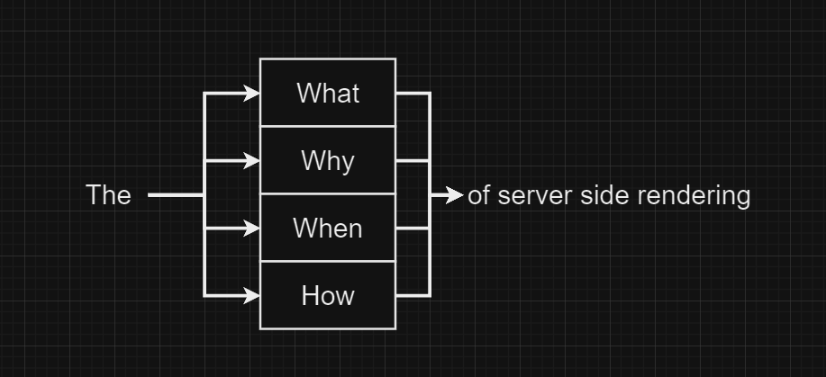
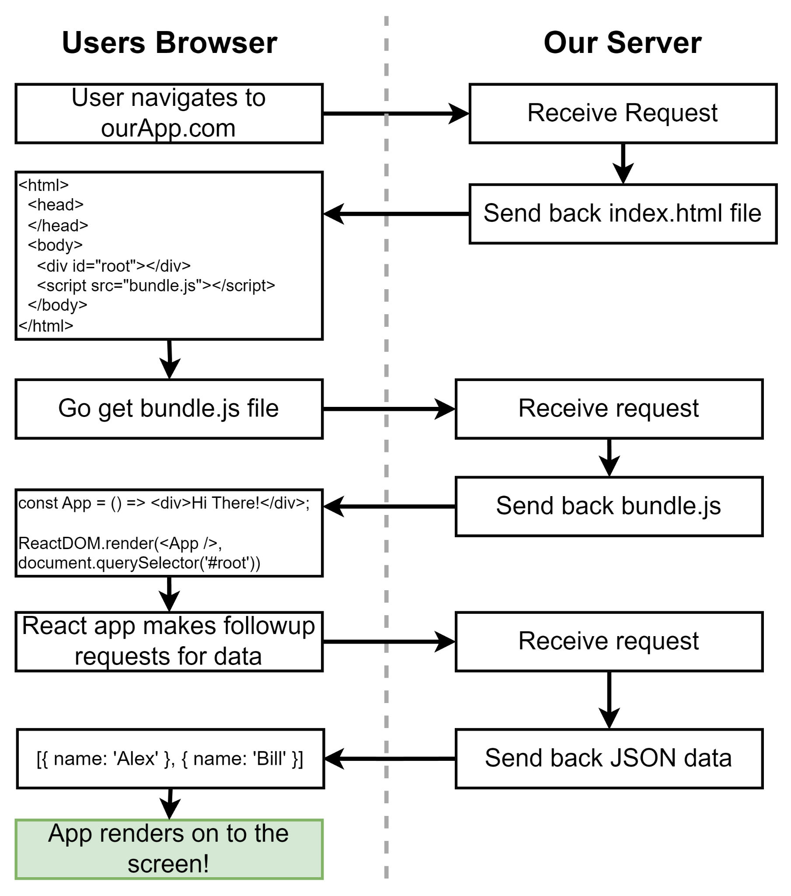

# Getting Started
- [Getting Started](#getting-started)
  - [Why Server Side Rendering](#why-server-side-rendering)
    - [1. **What is Server-Side Rendering?**](#1-what-is-server-side-rendering)
      - [Example:](#example)
    - [2. **Why use Server-Side Rendering?**](#2-why-use-server-side-rendering)
    - [3. **When to use Server-Side Rendering?**](#3-when-to-use-server-side-rendering)
      - [Use Cases:](#use-cases)
      - [Situations to Avoid SSR:](#situations-to-avoid-ssr)
    - [4. **How to Implement Server-Side Rendering?**](#4-how-to-implement-server-side-rendering)
      - [Example 1: Using **Next.js** (React Framework)](#example-1-using-nextjs-react-framework)
      - [Example 2: Using **Express.js** and a Template Engine](#example-2-using-expressjs-and-a-template-engine)
    - [Conclusion:](#conclusion)
  - [SSR Overview](#ssr-overview)
    - [1. **User Navigates to the App (User Request)**](#1-user-navigates-to-the-app-user-request)
    - [2. **Server Receives Request and Sends back `index.html`**](#2-server-receives-request-and-sends-back-indexhtml)
    - [Example:](#example-1)
    - [3. **Browser Receives `index.html` and Requests `bundle.js`**](#3-browser-receives-indexhtml-and-requests-bundlejs)
    - [4. **Server Responds with `bundle.js`**](#4-server-responds-with-bundlejs)
    - [5. **React Code Executes on the Client (Browser)**](#5-react-code-executes-on-the-client-browser)
      - [Example:](#example-2)
    - [6. **React App Makes Follow-Up Requests for Data**](#6-react-app-makes-follow-up-requests-for-data)
      - [Example:](#example-3)
    - [7. **Server Responds with JSON Data**](#7-server-responds-with-json-data)
    - [8. **React Renders the Data to the Screen**](#8-react-renders-the-data-to-the-screen)
      - [Example:](#example-4)
    - [Final Rendering:](#final-rendering)
    - [Key Takeaways:](#key-takeaways)

## Why Server Side Rendering



This diagram appears to outline the key aspects to consider about **Server-Side Rendering (SSR)**, focusing on **What**, **Why**, **When**, and **How** to use SSR in web development. Let’s explore each of these components in depth:

---

### 1. **What is Server-Side Rendering?**

**Server-Side Rendering (SSR)** is the process of rendering web pages on the server instead of in the browser (client-side). When a user requests a page, the server generates the HTML for that page and sends it to the client.

- In SSR, the HTML is **fully or partially rendered** by the server, and the browser only displays the content.
- This contrasts with **Client-Side Rendering (CSR)**, where the browser downloads a minimal HTML page, fetches the JavaScript, and renders the rest of the page dynamically.

#### Example:
- **SSR Example**: A Node.js server using Express and a template engine (like EJS or Handlebars) renders HTML on the server.
- **CSR Example**: A React app using **create-react-app** renders content on the client side after loading.

---

### 2. **Why use Server-Side Rendering?**

There are several reasons to use SSR, particularly for performance, SEO, and initial load time.

- **SEO**: Search engines like Google can better index server-rendered HTML content, which is crucial for websites that rely on organic search traffic.
  - Example: Blogs or e-commerce sites use SSR to ensure search engines can crawl product pages with complete metadata and descriptions.
  
- **Faster Initial Load**: SSR helps reduce the time to **First Paint (FP)** or **First Contentful Paint (FCP)**. When HTML is generated on the server, it arrives fully rendered, and the browser can display content faster.
  - Example: A news website where users expect content to load quickly, SSR provides the first meaningful paint without waiting for client-side JavaScript execution.

- **Social Media Sharing**: Social media platforms like Facebook or Twitter rely on metadata (like open graph tags) in HTML for rich link previews. SSR ensures the metadata is available when a URL is shared.
  - Example: When you share a blog post, the image and title appear because the server-side rendered HTML provides these tags.

- **Better Performance for Low-End Devices**: Rendering HTML on the server can offload computation-heavy tasks (like rendering React components) from the client, making the experience faster for users on slower devices.
  - Example: Users with older smartphones will experience faster load times on an SSR-rendered web app compared to a client-rendered app.

---

### 3. **When to use Server-Side Rendering?**

SSR is not always the best choice. It is used when specific conditions or use cases demand the advantages SSR provides.

#### Use Cases:
- **SEO Requirements**: If your app heavily depends on SEO for organic traffic, SSR is ideal because search engines can fully index the HTML content.
  - Example: E-commerce sites like Amazon or marketplaces like eBay benefit from SSR because they have many product pages that need to be indexed by search engines.
  
- **Initial Load Time is Critical**: If the primary concern is minimizing the **Time to First Byte (TTFB)** and **First Paint (FP)**, SSR is beneficial as the content is available almost instantly.
  - Example: Landing pages or marketing pages that aim to captivate users from the first visit.
  
- **Content-Rich Applications**: Websites that present heavy content (like news websites, social media, etc.) often use SSR to deliver content faster to the user.
  - Example: The New York Times renders articles server-side to provide immediate content to the user.

#### Situations to Avoid SSR:
- **Heavy Interactivity**: If your application requires frequent updates on the page (like single-page applications or apps with real-time features), SSR might not be necessary. Instead, **Client-Side Rendering (CSR)** or **Static Site Generation (SSG)** might be more efficient.
  - Example: Real-time dashboards or chat applications would benefit more from CSR.

- **Increased Server Load**: SSR can put additional pressure on the server as every page request requires rendering HTML on the server. For high-traffic applications, SSR can increase server costs and complexity.

---

### 4. **How to Implement Server-Side Rendering?**

There are several ways to implement SSR, depending on the framework or tech stack you're using.

#### Example 1: Using **Next.js** (React Framework)
- Next.js allows you to implement SSR with ease for React applications.
  
  ```javascript
  // pages/index.js
  export async function getServerSideProps() {
    const data = await fetch('https://api.example.com/data');
    return {
      props: { data }, // will be passed to the page component as props
    };
  }

  function Page({ data }) {
    return <div>{data.title}</div>;
  }

  export default Page;
  ```

- The `getServerSideProps` function in Next.js is executed on the server, fetching the data and rendering the page on the server before sending it to the client.

#### Example 2: Using **Express.js** and a Template Engine

```javascript
const express = require('express');
const app = express();
const path = require('path');
const ejs = require('ejs');

// Set up EJS view engine
app.set('view engine', 'ejs');
app.set('views', path.join(__dirname, 'views'));

app.get('/', (req, res) => {
    res.render('index', { title: 'Home Page' });
});

app.listen(3000, () => {
    console.log('Server running on port 3000');
});
```

- Here, Express uses the **EJS** template engine to render dynamic content server-side. When a request is made to the root `/`, it renders an HTML page using the `index.ejs` file on the server and sends it back to the client.

---

### Conclusion:

This diagram captures the high-level overview of SSR:
- **What**: SSR generates HTML on the server, not the client.
- **Why**: It improves SEO, initial load time, and user experience on low-end devices.
- **When**: SSR is ideal for SEO-driven, content-heavy apps but may not be suitable for real-time, highly interactive apps.
- **How**: Use frameworks like **Next.js** or libraries like **Express.js** to implement SSR depending on your application’s requirements.

Ultimately, SSR is a powerful approach for web applications when performance, SEO, and the initial user experience are prioritized.

## SSR Overview



This diagram explains the **client-server interaction** in a typical **React (Client-Side Rendering) application**. Let’s break down each part of the diagram and explain it in depth:

### 1. **User Navigates to the App (User Request)**

- The user starts by entering a URL (e.g., `ourApp.com`) into the browser or clicking a link that triggers a page load.
- This sends an HTTP request to the **server** to fetch the HTML content for the app.

### 2. **Server Receives Request and Sends back `index.html`**

- The server receives this request and responds by sending back the **`index.html` file**.
- The `index.html` file is a basic HTML file with a `<div>` element with an `id="root"` or some other identifier. This is where the **React app** will later render.
- The `<script src="bundle.js"></script>` tag is also included, which instructs the browser to load the **JavaScript bundle** (which contains the React app).

### Example:

Here’s what the `index.html` file might look like:

```html
<!DOCTYPE html>
<html lang="en">
<head>
    <meta charset="UTF-8">
    <meta name="viewport" content="width=device-width, initial-scale=1.0">
    <title>React App</title>
</head>
<body>
    <div id="root"></div> <!-- This is where React will render the app -->
    <script src="bundle.js"></script> <!-- The JavaScript bundle containing React code -->
</body>
</html>
```

### 3. **Browser Receives `index.html` and Requests `bundle.js`**

- The browser parses the received HTML and realizes it needs to load the **`bundle.js`** file (which contains the React code).
- It sends a second HTTP request to the server, asking for the `bundle.js` file.

### 4. **Server Responds with `bundle.js`**

- The server sends back the **`bundle.js`** file. This file contains the **React application code** that was previously bundled (using tools like Webpack, Rollup, etc.).
- This JavaScript file includes everything necessary to initialize and render the React app on the client-side.

### 5. **React Code Executes on the Client (Browser)**

- Once the browser receives the `bundle.js`, it executes the JavaScript code.
- The React code contains components and logic that dynamically **renders the UI** inside the `<div id="root"></div>` placeholder in `index.html`.

#### Example:

```javascript
const App = () => {
    return <div>Hi There!</div>;
};

ReactDOM.render(<App />, document.querySelector('#root')); // Rendering the App component
```

In this example, the `App` component is a simple React component that renders "Hi There!" on the screen.

### 6. **React App Makes Follow-Up Requests for Data**

- After the initial React app renders, it may need to fetch additional data from the server to display dynamic content (e.g., fetching a list of users, products, etc.).
- The React app makes **AJAX (Asynchronous JavaScript and XML)** requests (commonly using `fetch` or `axios`) to retrieve data from an API.

#### Example:

```javascript
fetch('/api/users')
  .then(response => response.json())
  .then(data => {
    // Use the data to update the app’s state or render additional components
    console.log(data); // [{ name: 'Alex' }, { name: 'Bill' }]
  });
```

### 7. **Server Responds with JSON Data**

- The server receives the request for data (in this case, a request for users) and responds with **JSON data** (or any other format required by the app).
- For example, if the app requests user data, the server might return:

```json
[
  { "name": "Alex" },
  { "name": "Bill" }
]
```

### 8. **React Renders the Data to the Screen**

- Once the React app receives the data from the server (e.g., the list of users), it updates its state and **re-renders** the relevant parts of the UI.
- React’s **virtual DOM** handles efficiently re-rendering the specific components that need updating based on the new data.

#### Example:

```javascript
const App = () => {
  const [users, setUsers] = useState([]);

  useEffect(() => {
    fetch('/api/users')
      .then(response => response.json())
      .then(data => setUsers(data));
  }, []);

  return (
    <div>
      {users.map(user => <div key={user.name}>{user.name}</div>)}
    </div>
  );
};

ReactDOM.render(<App />, document.querySelector('#root'));
```

In this example, the `App` component initially displays nothing. After the data is fetched from `/api/users`, it updates the state (`users`) with the list of users, and React re-renders the UI to show the names.

### Final Rendering:

After all the requests have been processed, the **React app fully renders** on the screen with dynamic content, such as the names of users in this example.

---

### Key Takeaways:

1. **Client-Side Rendering (CSR)**:
   - The initial HTML file (`index.html`) is bare-bones, only containing the `<div>` where React will mount.
   - The heavy lifting (rendering) is done by the browser after fetching the `bundle.js`.

2. **Dynamic Data**:
   - The React app makes follow-up requests for data (via AJAX).
   - The server provides the requested data in JSON format, and React renders it dynamically.

3. **Separation of Concerns**:
   - The server provides **static files** (HTML, JavaScript) and **data** (JSON) in separate requests.
   - The browser is responsible for rendering the content dynamically using React’s JavaScript code.

This flow is typical in **single-page applications (SPAs)** where the server sends a minimal HTML shell, and the client renders the app using JavaScript, fetching data asynchronously as needed.