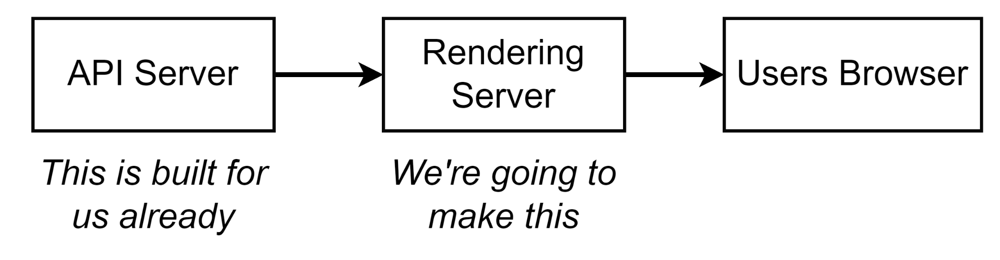
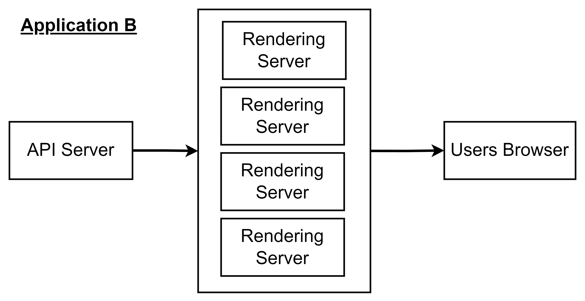
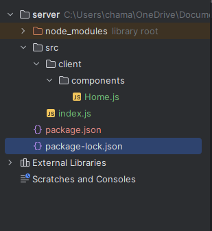
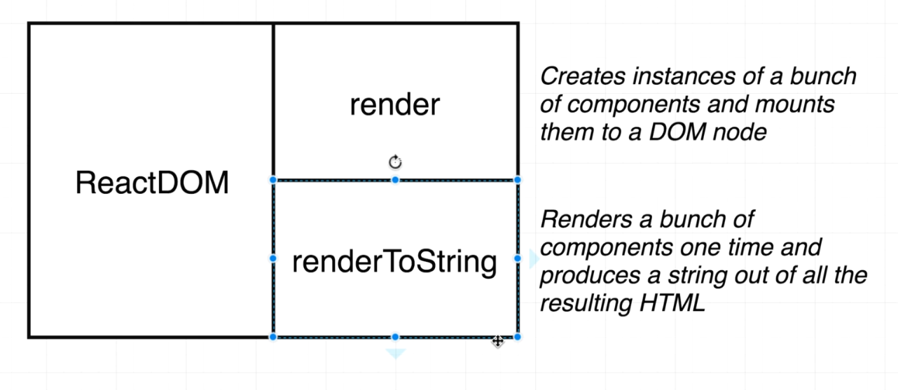

# 

- [](#)
  - [001 App Overview](#001-app-overview)
  - [002 Server Architecture Approach](#002-server-architecture-approach)
    - [Components:](#components)
    - [Deep Dive with an Example:](#deep-dive-with-an-example)
    - [Why Separate the Rendering Server?](#why-separate-the-rendering-server)
    - [Conclusion:](#conclusion)
    - [Components:](#components-1)
    - [Flow:](#flow)
      - [Step-by-Step Walkthrough](#step-by-step-walkthrough)
    - [Example Scenario: Building a Product Catalog](#example-scenario-building-a-product-catalog)
      - [User Journey Example:](#user-journey-example)
    - [Advantages of This Architecture:](#advantages-of-this-architecture)
    - [Conclusion:](#conclusion-1)
    - [Components:](#components-2)
    - [Flow of the Architecture:](#flow-of-the-architecture)
    - [Example Scenario: Serving a Product Page](#example-scenario-serving-a-product-page)
    - [Key Characteristics of this Architecture:](#key-characteristics-of-this-architecture)
    - [Benefits of Using Multiple Rendering Servers:](#benefits-of-using-multiple-rendering-servers)
    - [Conclusion:](#conclusion-2)
  - [004 Boilerplate Setup](#004-boilerplate-setup)
  - [005 Express Setup](#005-express-setup)
  - [006 The RenderToString Function](#006-the-rendertostring-function)
  - [007 JSX on the Server](#007-jsx-on-the-server)
  - [008 Server Side Webpack](#008-server-side-webpack)
  - [009 Breather and Review](#009-breather-and-review)


## 001 App Overview


## 002 Server Architecture Approach



This diagram illustrates a common architecture pattern where a **Rendering Server** is responsible for generating the HTML or other content for the **Users Browser**, based on data fetched from an **API Server**. Here's a detailed breakdown with examples:

### Components:

1. **API Server**:
   - The API server already exists and is responsible for managing the data. It provides endpoints (e.g., RESTful APIs, GraphQL) for fetching, updating, and manipulating resources (e.g., user information, product details, etc.).
   - Example: A backend server built with Node.js or any other technology, handling API requests like `GET /users` or `POST /orders`.

2. **Rendering Server**:
   - This is the new server that needs to be built. It will take requests from the browser, fetch the necessary data from the API Server, and render the appropriate HTML (or other content) based on that data.
   - The Rendering Server acts as a middle layer between the **API server** and the **User's Browser**.
   - Example: You might build this rendering server using Node.js and a framework like **Next.js** (for React-based server-side rendering), or Express.js, which will render views (HTML) dynamically using templates or other rendering methods.

3. **User's Browser**:
   - The user's browser makes a request to the Rendering Server, which returns HTML or JSON data based on the fetched data from the API Server. The browser then displays the content to the user.
   - Example: A user visiting `www.example.com/products` would send a request to the Rendering Server. The Rendering Server then fetches the list of products from the API server, generates the HTML page, and sends it back to the browser for display.

### Deep Dive with an Example:

Let’s imagine we are building a product catalog web application.

- **API Server (Already Built)**:
  - This server provides endpoints like:
    - `GET /api/products` — Returns a list of all products.
    - `GET /api/products/:id` — Returns details of a specific product.

- **Rendering Server (To be Built)**:
  - **Step 1**: User visits `www.catalogapp.com/products`.
  - **Step 2**: The **Rendering Server** receives the request from the browser.
  - **Step 3**: The Rendering Server makes an API call to the **API Server** (for example, to `GET /api/products`) to fetch the product data.
  - **Step 4**: After receiving the data from the API server, the Rendering Server uses it to generate HTML (or another format) and sends it back to the user’s browser.
  
    In practice, if you’re using Node.js with a templating engine like **Pug** or **Handlebars**, the Rendering Server will fill in the data in the HTML templates:
    
    ```js
    app.get('/products', async (req, res) => {
      const products = await fetch('https://api.catalogapp.com/api/products').then(response => response.json());
      res.render('productsPage', { products });
    });
    ```

  - **Step 5**: The **User's Browser** receives the generated HTML and displays the list of products.

### Why Separate the Rendering Server?

1. **Separation of Concerns**:
   - The API server is focused solely on handling the logic and business rules related to data (CRUD operations, validations, etc.).
   - The Rendering Server is responsible for **presenting** the data to the user, taking care of how data is displayed (using templates or client-side rendering frameworks like React or Vue).

2. **Server-Side Rendering (SSR)**:
   - In many applications, especially where SEO is important, rendering the HTML on the server and sending it to the user's browser can greatly improve performance and allow search engines to crawl the content.
   - For example, frameworks like **Next.js** (for React) and **Nuxt.js** (for Vue) make it easy to implement SSR by letting the server pre-render pages based on data fetched from the API server before sending it to the browser.

3. **Better User Experience**:
   - By doing the rendering on the server, you can reduce the initial load time and improve the performance of your web application.
   - The browser receives fully-rendered HTML, which means users can interact with the page sooner, instead of waiting for JavaScript to load and execute client-side.

### Conclusion:
- **API Server**: Focuses on providing data (already built).
- **Rendering Server**: Responsible for fetching data from the API server and rendering content (what needs to be built).
- **User's Browser**: Receives and displays the fully-rendered content.

By implementing a **Rendering Server**, you achieve a clear separation between data management and UI rendering, allowing better scalability, improved SEO, and faster load times for the end-user.


The diagram you’ve shared outlines the architecture of **Application A**, which involves multiple **API Servers**, a **Rendering Server**, and the **User’s Browser**. Let’s break this down in detail and walk through how this architecture functions, with relevant examples.

### Components:

1. **API Servers (Multiple)**
   - In this architecture, **Application A** consists of multiple API servers, each potentially responsible for different types of data or services. These API servers act as the data providers for the application, returning structured data (often in JSON or XML format) when requested.
   - Example: One API server might handle user authentication (`auth.api.com`), another might manage product data (`products.api.com`), and another could handle orders (`orders.api.com`).

2. **Rendering Server**
   - The **Rendering Server** acts as the middle layer between the API Servers and the **User’s Browser**. Its main responsibility is to gather data from the API servers, process or render it (e.g., into HTML or JavaScript), and send it to the user’s browser.
   - Example: The rendering server might be a **Node.js server** using frameworks like **Next.js** or **Express.js**, which fetches data from the APIs, applies templates, and returns a fully rendered webpage to the user's browser.
   
3. **User's Browser**
   - The **User's Browser** receives fully or partially rendered content from the **Rendering Server**, which is either immediately visible to the user or further enhanced with additional data-fetching requests or client-side rendering.
   - Example: The user visits `www.applicationA.com/products`, the rendering server delivers the page with the product listing pre-fetched from the **API Servers**.

---

### Flow:

#### Step-by-Step Walkthrough

1. **User's Browser Requests a Web Page**:
   - A user types `www.applicationA.com` into their browser or clicks a link. This triggers an HTTP request that is sent to the **Rendering Server**.

2. **Rendering Server Receives Request**:
   - Upon receiving the request, the rendering server determines what data is required to build the page. For example, to render the homepage, it may need data from various API servers: one to get the latest products, another to fetch promotional banners, and another for user authentication data (if logged in).
   - **Example**: The user lands on a homepage. The rendering server fetches promotional banners from one API (`/promotions`), the product listing from another API (`/products`), and user data from an authentication API (`/auth/user`).

3. **Fetching Data from API Servers**:
   - The **Rendering Server** now sends requests to the multiple **API Servers** to fetch all the necessary data.
   - This could include:
     - Sending a `GET` request to the promotions API to retrieve promotional banners.
     - Sending a `GET` request to the products API to get a list of featured products.
     - Sending a `GET` request to the user authentication API to check if the user is logged in.
   
4. **Rendering the Data**:
   - Once the rendering server has received responses from the multiple API servers, it assembles the data and processes it using a template engine (e.g., Pug, EJS, or JSX in React frameworks).
   - This processing results in HTML or JavaScript content that is ready to be displayed on the user's browser.
   - **Example**: The rendering server takes the list of products and promotional banners, applies them to a predefined HTML structure, and generates a fully populated webpage.

5. **Sending the Response to the User's Browser**:
   - After rendering the HTML content, the rendering server sends it back to the user's browser as the response.
   - **Example**: The browser receives the fully-rendered HTML, CSS, and JavaScript, and the homepage is displayed to the user with all the products, banners, and relevant information.

6. **Additional Client-Side Enhancements (Optional)**:
   - Sometimes, the **Rendering Server** may send partially-rendered content to the user's browser, where additional data fetching and rendering happen on the client-side. This is known as **client-side rendering** (CSR) or **hydration**.
   - **Example**: While the server sends basic HTML for the products, the actual product descriptions might be lazy-loaded on the client-side by fetching additional information via APIs using JavaScript once the user scrolls down.

---

### Example Scenario: Building a Product Catalog

Let’s assume we are building a product catalog application for **Application A**.

- **API Servers**:
  - One API server is responsible for returning product data (`products.api.com`).
  - Another API server returns user authentication data (`auth.api.com`).
  - A third API returns order details (`orders.api.com`).

#### User Journey Example:

1. The user navigates to `www.applicationA.com/products`.
2. The **Rendering Server** receives the request.
3. The Rendering Server sends multiple requests to:
   - The **Products API** to get the list of products.
   - The **Auth API** to check if the user is logged in (to personalize the page if necessary).
4. The **API Servers** respond with the required data:
   - The **Products API** returns a list of products (`GET /products`).
   - The **Auth API** returns the current user's login status (`GET /auth/user`).
5. The **Rendering Server** processes the data using a template (e.g., React components or HTML templates), generating an HTML page that includes:
   - A grid of products with their images, prices, and descriptions.
   - A personalized message for the user if they are logged in.
6. The **User's Browser** displays the fully rendered page.

---

### Advantages of This Architecture:

1. **Scalability**:
   - By separating concerns, the **API Servers** focus solely on providing data, while the **Rendering Server** manages how the data is presented. This modular design allows each part to scale independently.
   - For instance, if traffic increases on the product catalog, only the **Products API** might need to be scaled, leaving the other parts of the system unaffected.

2. **Performance Optimization**:
   - The **Rendering Server** reduces load on the user's browser by delivering fully rendered content. This approach can speed up initial page load times, especially for slower devices or connections.
   
3. **Enhanced SEO**:
   - Since the **Rendering Server** delivers pre-rendered HTML, search engines can easily crawl the content, improving the website's SEO ranking.
   - Client-side rendering alone often suffers from SEO challenges, as many web crawlers struggle to process JavaScript-heavy pages.

4. **Flexibility**:
   - This architecture allows multiple teams to work independently. For example, the **API team** can update the logic or data structure of the API servers without affecting how the frontend is rendered. Similarly, the frontend team can improve the UI without worrying about the data structure on the backend.

---

### Conclusion:
This architecture, where the **Rendering Server** acts as a mediator between multiple **API Servers** and the **User's Browser**, enables efficient data handling, improved scalability, and better user experiences. It also supports various rendering techniques, such as **Server-Side Rendering (SSR)** and **Client-Side Rendering (CSR)**, offering flexibility for complex web applications.



The diagram for **Application B** shows an architecture where multiple **Rendering Servers** interface between a single **API Server** and the **User’s Browser**. Here’s a detailed explanation of how this system works, with practical examples:

### Components:

1. **API Server**:
   - The **API Server** in this architecture is responsible for providing the necessary data to the **Rendering Servers**. It may expose different endpoints to return data in response to HTTP requests (e.g., RESTful API).
   - **Example**: The API server might provide endpoints like:
     - `/users` to get user details.
     - `/products` to retrieve product information.
     - `/orders` to manage user orders.

2. **Rendering Servers**:
   - **Rendering Servers** in this case are responsible for fetching data from the **API Server**, processing that data (i.e., applying templates or rendering logic), and delivering the final HTML, CSS, and JavaScript to the **User’s Browser**.
   - Multiple **Rendering Servers** in this architecture allow for load balancing, meaning that requests from different users can be handled by different servers to ensure scalability and better performance.
   - **Example**: There may be four identical rendering servers, all serving the same application but handling separate user requests in a balanced manner.

3. **User's Browser**:
   - The **User’s Browser** interacts with the **Rendering Servers**. When a user requests a page, their browser sends a request to one of the rendering servers (decided by a load balancer), and the server responds with the fully or partially rendered HTML page.
   - **Example**: A user opens the URL `www.applicationB.com/products`. The request is routed to one of the available **Rendering Servers**, which communicates with the **API Server**, fetches the necessary product data, renders it into an HTML structure, and sends it back to the browser.

---

### Flow of the Architecture:

1. **User Browser Sends a Request**:
   - The user sends an HTTP request to the **Rendering Server** by visiting the application’s web page, e.g., `www.applicationB.com`.

2. **Request Hits a Load Balancer** (not shown in the diagram):
   - Before reaching the **Rendering Servers**, the request might be distributed by a load balancer to ensure the request is handled by the least busy server. The load balancer distributes incoming requests to one of the available **Rendering Servers**.

3. **Rendering Server Fetches Data**:
   - Once the request reaches a **Rendering Server**, it determines what data it needs to render the page. It sends API requests to the **API Server** to retrieve this data.
   - **Example**: If the user is on the `/products` page, the rendering server might send a `GET /products` request to the **API Server** to retrieve product data.

4. **API Server Responds with Data**:
   - The **API Server** responds with the requested data in JSON or XML format. For instance, a `GET /products` request might return a list of products, including their names, descriptions, prices, and availability.
   - **Example JSON response**:
     ```json
     [
       { "id": 1, "name": "Product A", "price": 25.99 },
       { "id": 2, "name": "Product B", "price": 15.99 }
     ]
     ```

5. **Rendering Server Processes the Data**:
   - The **Rendering Server** takes the data returned by the **API Server** and uses it to generate the final HTML page that will be sent to the user's browser.
   - This can involve inserting the product data into an HTML template using a template engine (e.g., React, Handlebars, EJS).
   - **Example**: The rendering server might take the product data and embed it into an HTML structure like:
     ```html
     <div class="product">
       <h1>Product A</h1>
       <p>Price: $25.99</p>
     </div>
     <div class="product">
       <h1>Product B</h1>
       <p>Price: $15.99</p>
     </div>
     ```

6. **Rendering Server Sends Response to the Browser**:
   - After processing the data, the **Rendering Server** sends the rendered HTML page back to the user’s browser. The browser renders the page, displaying the content to the user.

7. **Browser Renders the Page**:
   - The user’s browser takes the response from the server (which contains HTML, CSS, and JavaScript) and displays it on the screen.

---

### Example Scenario: Serving a Product Page

Let’s consider an example where a user is browsing products on **Application B**.

1. The user opens `www.applicationB.com/products`.
2. Their request is routed to one of the **Rendering Servers** (e.g., the third server in the stack).
3. The rendering server sends a `GET` request to the **API Server**: `GET /products`.
4. The **API Server** returns a list of products in JSON format.
5. The **Rendering Server** processes this data, applies it to an HTML template, and generates a webpage showing the list of products.
6. The rendered page is sent back to the **User's Browser**, where the products are displayed.

---

### Key Characteristics of this Architecture:

1. **Load Balancing**:
   - The use of multiple **Rendering Servers** ensures that the system can handle a large number of concurrent users by distributing the load. Each request is sent to a different server, preventing any single server from becoming overwhelmed.
   - **Example**: If **Rendering Server 1** is busy processing several requests, a new incoming request will be directed to **Rendering Server 2**.

2. **Separation of Concerns**:
   - The **API Server** handles data retrieval and processing, while the **Rendering Servers** focus on rendering the content for the user. This separation makes the architecture modular, scalable, and maintainable.
   - **Example**: The **API Server** can be updated independently to optimize database queries without affecting the rendering logic.

3. **Scalability**:
   - This architecture is highly scalable because you can add more **Rendering Servers** as needed. The more traffic the application receives, the more rendering servers can be deployed to handle requests.
   - **Example**: During peak traffic (such as during a product launch), additional rendering servers can be spun up to handle the increased load, ensuring users continue to have a fast and responsive experience.

4. **Faster Page Loads**:
   - Since the **Rendering Servers** return pre-rendered HTML, the user’s browser does not need to wait for JavaScript to fetch data and render content. The page can load more quickly, especially on slower devices or connections.

---

### Benefits of Using Multiple Rendering Servers:

- **Increased Capacity**: Multiple rendering servers can handle a larger number of requests, allowing the system to scale with user demand.
- **Improved Fault Tolerance**: If one rendering server goes down, the system can continue to operate as other rendering servers are still available to handle requests.
- **Seamless User Experience**: Users experience fast page loads and minimal downtime, even during high-traffic periods.

---

### Conclusion:

In **Application B**, the architecture is designed to handle scalability by distributing the load across multiple **Rendering Servers**. The **Rendering Servers** communicate with a centralized **API Server** to fetch the necessary data, process it, and send fully-rendered content back to the **User's Browser**. This approach allows for an efficient, scalable, and fast system that can handle multiple concurrent users while maintaining a consistent and responsive user experience.
## 004 Boilerplate Setup


## 005 Express Setup

```json
{
  "name": "server",
  "version": "1.0.0",
  "main": "index.js",
  "scripts": {
    "test": "echo \"Error: no test specified\" && exit 1"
  },
  "keywords": [],
  "author": "",
  "license": "ISC",
  "description": "",
  "dependencies": {
    "axios": "^1.7.7",
    "babel-cli": "^6.26.0",
    "babel-core": "^6.26.3",
    "babel-loader": "^9.1.3",
    "babel-preset-env": "^1.7.0",
    "babel-preset-es2015": "^6.24.1",
    "babel-preset-es2017": "^6.24.1",
    "babel-preset-react": "^6.24.1",
    "compression": "^1.7.4",
    "concurrently": "^9.0.0",
    "express": "^4.20.0",
    "lodash": "^4.17.21",
    "nodemon": "^3.1.4",
    "npm-run-all": "^4.1.5",
    "react": "^18.3.1",
    "react-dom": "^18.3.1",
    "react-helmet": "^6.1.0",
    "react-redux": "^9.1.2",
    "react-router-config": "^5.1.1",
    "react-router-dom": "^6.26.2",
    "redux": "^5.0.1",
    "redux-thunk": "^3.1.0",
    "serialize-javascript": "^6.0.2",
    "webpack": "^5.94.0",
    "webpack-dev-server": "^5.1.0",
    "webpack-merge": "^6.0.1",
    "webpack-node-externals": "^3.0.0"
  }
}

```



```jsx
import React from "react";

const Home = () => {
    return (
        <div>
            <h1>Home</h1>
        </div>
    );
}

export default Home;

```

```js
const express = require('express');

const app = express();


app().get('/', (req, res) => {
    res.send('Hello World');
});

app.listen(3000, () => {
    console.log('Server is running on http://localhost:3000');
});

```


## 006 The RenderToString Function

## 007 JSX on the Server
## 008 Server Side Webpack
## 009 Breather and Review
